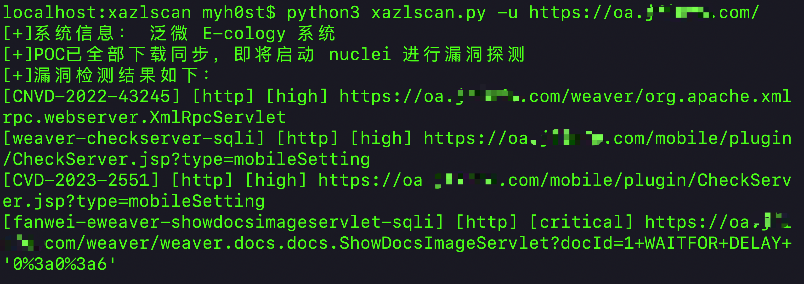
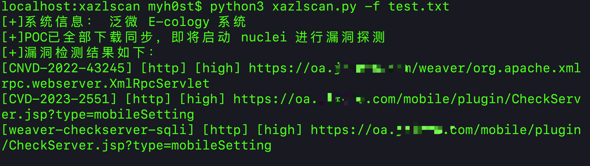
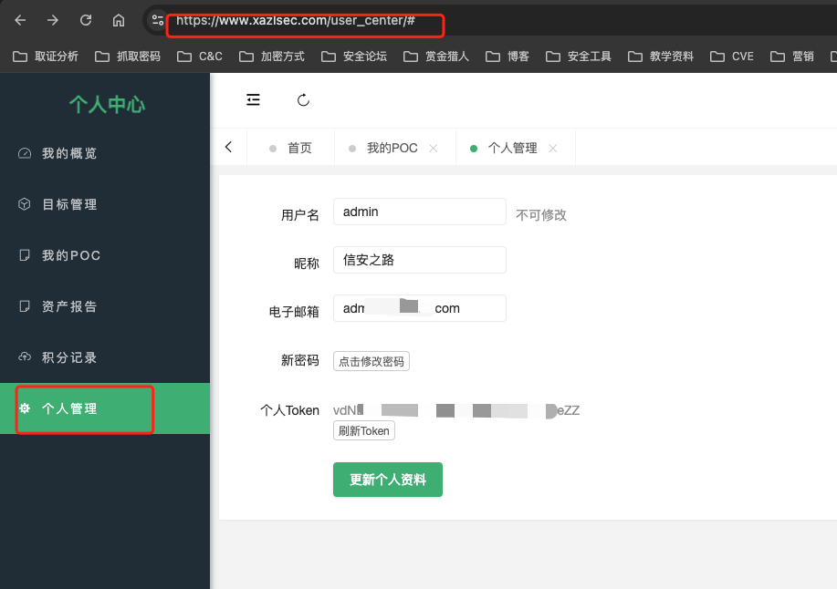
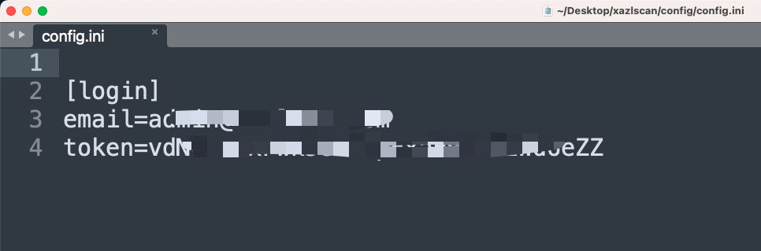

一键检测系统历史漏洞，信安之路POC管理平台配套自动化工具，支持单网站检测以及指定目标文件两种方式，所需POC一次解锁，终身可用，效果如图：

1、单网站检测

2、多网站检测

首次使用该工具，需要注册信安之路 POC 管理平台，并生成属于自己的 Token，然后修改配置文件为自己的邮箱和Token。

1、注册地址：https://www.xazlsec.com

2、前往用户中心-》个人管理 https://www.xazlsec.com/user_center/#

3、修改配置文件：config/config.ini

4、下载 nuclei 工具至 bin 目录，给 nuclei 增加可执行权限后方可使用，没有bin 目录可以自己创建

